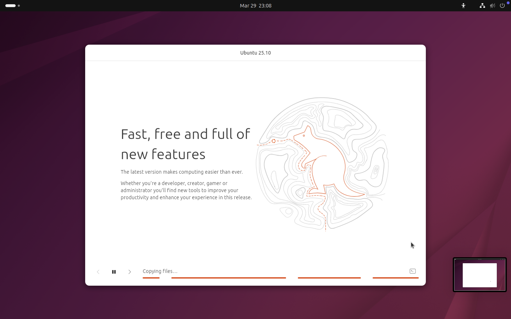
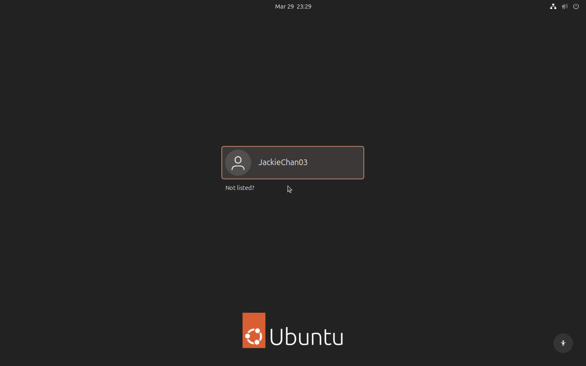
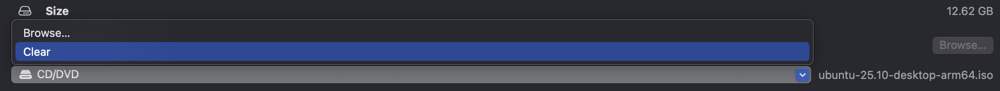

# 🧩 User Guide: Install Lubuntu on Mac (Apple Silicon/ Intel) using UTM

This guide walks you through:
1. Installing UTM
2. Installing Ubuntu in a VM
3. Converting Ubuntu → Lubuntu
4. Cleaning up the system

---

# 📌 Device Requirements

- Mac (Intel or Apple Silicon)
- At least:
  - 4GB RAM (8GB recommended)
  - 25GB storage
- Internet connection

---

# 🚀 Step 1: Install UTM

1. Download UTM for free from:
   https://mac.getutm.app/
2. Install and open UTM

---

# 💿 Step 2: Download Ubuntu ISO

1. Go to:
   https://ubuntu.com/download/desktop
2. Download the latest Ubuntu Desktop ISO  
   Example:
   - Ubuntu 25.10 (ARM 64-bit architecture) for Apple Silicon Mac
   https://cdimage.ubuntu.com/releases/25.10/release/ubuntu-25.10-desktop-arm64.iso


---

# 🖥️ Step 3: Create Virtual Machine in UTM

1. Open UTM → Click **Create New**
2. Choose:
- **Virtualize** (Apple Silicon - recommended)
- **Emulate** (if using x86 ISO on ARM)

3. Select:
- **Linux**

4. Boot ISO Image:
- Select your Ubuntu ISO file

---

## ⚙️ Recommended Settings for VM

- Memory: **2-4GB (2048-4096 MB)** (Adjustable)
- CPU: **2–4 cores**
- Storage: **25GB+**
- Shared Directory (Optional)
- Summary: Tick Open VM Settings
- Display/Interface : Ensure **VirtIO-GPU** is used (normally automatically configured)

---

# 🧩 Step 4: Install Ubuntu

1. Start VM
2. Select:
**Install Ubuntu**
3. Follow installer:
- Language
- Keyboard
- Normal installation
- Erase disk (VM only, safe)
- Create username/password

4. Wait for installation to complete
   


---

# 🔁 Step 5: First Boot Setup

After installation:
- Close VM
- Remove ISO if prompted
  

- Restart and Log into Ubuntu
  


---

# 🚀 Step 6: Convert Ubuntu → Lubuntu

Open Terminal and run:

```bash
sudo apt update && sudo apt upgrade -y && sudo apt install lubuntu-desktop sddm -y && echo "/usr/bin/sddm" | sudo tee /etc/X11/default-display-manager && sudo reboot
```

Then, select **SDDM** as default manager in the display.

✅ What this does
- Installs Lubuntu (LXQt desktop)
- Installs SDDM display manager
- Sets **SDDM** as default
- Reboots system

---

# 🔐 Step 7: Select Lubuntu Session

After reboot:

1. At login screen
2. Click ⚙️ or Session
3. Select Lubuntu
4. Log in



---

# ✅ Step 8: Verify Installation

Run:

```bash
sudo apt update

echo $XDG_CURRENT_DESKTOP
```

Expected output:

```
LXQt
```

---

# 🔒 Step 9: Set Lubuntu as Default

Run:

```bash
echo -e "[General]\nSession=Lubuntu" > ~/.dmrc
chmod 644 ~/.dmrc

cat ~/.dmrc
```

Expected Output:
```
[General]
Session=Lubuntu
```

# 🧹 Step 10: Remove Ubuntu Desktop (Optional but recommended)

⚠️ Only after confirming Lubuntu works

Run:

```bash
sudo apt remove ubuntu-desktop gnome-shell -y
sudo apt autoremove -y
```

Restart kernel:

```bash
sudo reboot
```

## ⚡ Optional: Ultra-Light Setup (Better Performance)

Instead of full Lubuntu, install minimal LXQt:

Run:

```bash
sudo apt update && sudo apt install lxqt-core sddm -y && echo "/usr/bin/sddm" | sudo tee /et
```

# 📞 Support / Contact

If you encounter any issues during installation or usage, feel free to reach out:

- **Email:** 1231302741@student.mmu.edu.my  
- **GitHub Issues:** [Submit an issue](https://github.com/DanielChan03/Lubuntu-desktop-on-Apple-Silicon-Macs-/issues)

We welcome feedback, bug reports, and suggestions to improve this guide.
